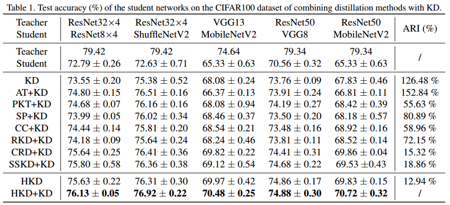

# HKD


Code for ICCV 2021 paper "Distilling Holistic Knowledge with Graph Neural Networks"

https://arxiv.org/abs/2108.05507


### cifia-100 result



The implementation of compared methods are based on the author-provided code and a open-source benchmark https://github.com/HobbitLong/RepDistiller.

## Installation
```
conda install --yes --file requirements.txt
```

## Running

1. Fetch the pretrained teacher models by:

    ```
    sh scripts/fetch_pretrained_teachers.sh
    ```
   which will download and save the models to `save/models`

2. Run distillation by commands in `scripts\run_cifar_distill.sh`. An example of running HKD is given by:

    ```
    python train_student.py --path_t ./save/models/resnet32x4_vanilla/ckpt_epoch_240.pth --distill hkd --model_s resnet8x4 -a 1 -b 3 --mode hkd --trial 1
    ```

## Citation

```
@misc{zhou2021distilling,
      title={Distilling Holistic Knowledge with Graph Neural Networks}, 
      author={Sheng Zhou and Yucheng Wang and Defang Chen and Jiawei Chen and Xin Wang and Can Wang and Jiajun Bu},
      year={2021},
      eprint={2108.05507},
      archivePrefix={arXiv},
      primaryClass={cs.CV}
}
```
